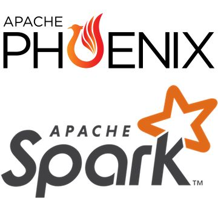

# OLAP On Apache Phoenix Using Apache Spark



[Apache Phoenix]("https://phoenix.apache.org/") is an open-source relational database engine that uses Apache HBase as it's backing store.
Apache Phoenix is natively best-suited for [Online Transactional Processing (OLTP)]("https://en.wikipedia.org/wiki/Online_transaction_processing") use-cases.
In this article we will be exploring how we can perform [Online Analytical Processing (OLAP)](https://en.wikipedia.org/wiki/Online_analytical_processing) on Apache Phoenix using [Apache Spark]("https://spark.apache.org/") analytical engine.

## Setup

For better reading experience, I have created an Docker Image that bundles all the pre-requisites.

Firstly pull the `phoenix-spark-connector-demo` Docker Image from DockerHub using the following command -

```bash
TODO
```

Once the Docker pull is successfull, Run the container using the following command -

```bash
TODO
```

Post the successful start-up of the Docker container,
 You will get a Jupter Notebook link use the same to interactively run the code explained in this article.

Incase you are interested in setting up pre-requisites yourself locally,
 Please refer to the following set of documentations -

* [JDK-8]("https://openjdk.org/install/")
* [Apache HBase 2.5+]("https://hbase.apache.org/book.html#quickstart")
* [Apache Phoenix 5.1+]("https://phoenix.apache.org/installation.html")
* [Apache Spark 3.0+]("https://spark.apache.org/downloads.html")
* [Apache Phoenix's connector for Apache Spark 6.0+]("https://github.com/apache/phoenix-connectors/tree/master/phoenix5-spark3#configuring-spark-to-use-the-connector")

Note for reader: I would recommend looking into the [Dockerfile]("") for getting more insights on the local setup.

## Exploring Apache Phoenix's Connector For Apache Spark

In this article we will be using the [Apache Phoenix's connector for Apache Spark]("https://github.com/apache/phoenix-connectors/tree/master/phoenix5-spark3").

Although Apache Spark natively supports connection to JDBC Databases like Apache Phoenix, It’s only able to parallelize queries by partioning on a numeric column. It also requires a known lower bound, upper bound and partition count in order to create split queries.

In contrast, the Apache Phoenix + Apache Spark connector is able to leverage the underlying splits provided by Phoenix in order to retrieve and save data across multiple workers. All that’s required is a database URL and a query statement. Optional SELECT columns can be given, as well as pushdown predicates for efficient filtering.
